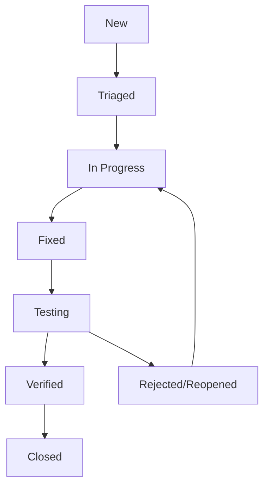

# Plan Testów - Crypto Arbitrage Dashboard

## 1. Wprowadzenie i cele testowania

### 1.1 Cel dokumentu
Niniejszy dokument opisuje kompleksowy plan testów dla platformy Crypto Arbitrage Dashboard - aplikacji webowej służącej do monitorowania i analizy okazji arbitrażowych na rynkach kryptowalut.

### 1.2 Główne cele testowania
- **Zapewnienie jakości:** Weryfikacja poprawności wszystkich funkcjonalności systemu
- **Bezpieczeństwo:** Potwierdzenie bezpiecznego przetwarzania danych użytkowników
- **Wydajność:** Sprawdzenie responsywności systemu przy dużym obciążeniu
- **Niezawodność:** Testowanie stabilności systemu w różnych scenariuszach
- **Kompatybilność:** Weryfikacja działania na różnych urządzeniach i przeglądarkach
- **Integralność danych:** Sprawdzenie poprawności zbierania, przetwarzania i prezentacji danych z giełd

### 1.3 Zakres produktu
System monitoruje okazje arbitrażowe na 5 głównych giełdach kryptowalut (Binance, Kraken, OKX, ByBit, Zonda), pobierając dane orderbooków dla 10 najpopularniejszych aktywów co 30 sekund, analizując spready i generując alerty w czasie rzeczywistym.

## 2. Zakres testów

### 2.1 Komponenty w zakresie testów

#### 2.1.1 Frontend (Astro + React)
- **Strony główne:** Dashboard, logowanie, rejestracja, preferencje
- **Komponenty React:** ArbitrageDashboard, SummaryCards, OpportunityTable, SpreadChart
- **System uwierzytelniania:** AuthContext, formularze logowania/rejestracji
- **UI/UX:** Komponenty Shadcn/ui, responsywność, accessibility

#### 2.1.2 Backend API (Astro endpoints)
- **Endpointy autoryzacji:** `/api/auth/login`, `/api/auth/register`, `/api/auth/logout`
- **Endpointy danych:** `/api/orderbooks`, `/api/assets`, `/api/exchanges`
- **Endpointy arbitrażu:** `/api/arbitrage-opportunities`, `/api/arbitrage-summary`
- **Endpointy użytkownika:** `/api/alerts`, `/api/user/favourites`

#### 2.1.3 Integracje z giełdami
- **Klienty giełd:** BinanceClient, BybitClient, KrakenClient, OKXClient
- **Pobieranie danych:** Orderbooki, statystyki 24h, obsługa rate limitów
- **DataCollector:** Harmonogram zbierania danych, obsługa błędów

#### 2.1.4 Silnik arbitrażu
- **ArbitrageEngine:** Wykrywanie okazji intra-exchange i cross-exchange
- **Kalkulacje:** Spready, potencjalne zyski, progi rentowności
- **Alerty:** Generowanie powiadomień przy przekroczeniu progów

#### 2.1.5 Baza danych (Supabase/PostgreSQL)
- **Tabele główne:** exchanges, assets, orderbooks, alerts, user_profiles
- **Indeksy:** Wydajność zapytań, optymalizacja
- **RLS (Row Level Security):** Bezpieczeństwo danych użytkowników

### 2.2 Komponenty poza zakresem testów
- **Infrastruktura hostingowa:** DigitalOcean, Docker
- **Zewnętrzne API giełd:** Testujemy tylko nasze integracje
- **Supabase Auth:** Testujemy tylko naszą implementację

## 3. Typy testów do przeprowadzenia

### 3.1 Testy jednostkowe (Unit Tests)
**Narzędzia:** Vitest, React Testing Library

#### 3.1.1 Komponenty React
```typescript
// Przykład struktury testów
describe('ArbitrageDashboard', () => {
  test('renderuje summary cards poprawnie')
  test('obsługuje selekcję okazji arbitrażowych')
  test('aktualizuje dane w czasie rzeczywistym')
})

describe('SummaryCards', () => {
  test('wyświetla prawidłowe metryki KPI')
  test('pokazuje trendy wzrostowe/spadkowe')
  test('obsługuje stany ładowania')
})
```

#### 3.1.2 Usługi i logika biznesowa
```typescript
describe('ArbitrageEngine', () => {
  test('kalkuluje spready intra-exchange poprawnie')
  test('wykrywa okazje cross-exchange')
  test('filtruje okazje poniżej progu rentowności')
})

describe('ExchangeClients', () => {
  test('BinanceClient pobiera orderbooki')
  test('obsługuje błędy API rate limiting')
  test('transformuje dane do standardowego formatu')
})
```

#### 3.1.3 Walidacja i bezpieczeństwo
```typescript
describe('ServerValidation', () => {
  test('waliduje dane logowania')
  test('sanityzuje input użytkownika')
  test('sprawdza rate limiting')
})
```

### 3.2 Testy integracyjne (Integration Tests)
**Narzędzia:** Playwright, Supertest

#### 3.2.1 API Endpoints
```typescript
describe('API Integration', () => {
  describe('/api/orderbooks', () => {
    test('zwraca dane z paginacją')
    test('filtruje po exchangeId i assetId')
    test('obsługuje nieprawidłowe parametry')
  })
  
  describe('/api/auth', () => {
    test('pełny flow logowania użytkownika')
    test('ochrona endpointów wymagających autoryzacji')
  })
})
```

#### 3.2.2 Integracja z bazą danych
```typescript
describe('Database Integration', () => {
  test('zapisuje orderbooki do bazy danych')
  test('pobiera dane z właściwymi relacjami')
  test('obsługuje transakcje i rollback')
})
```

#### 3.2.3 Integracja frontend-backend
```typescript
describe('Frontend-Backend Integration', () => {
  test('dashboard ładuje dane arbitrażu')
  test('filtry działają z API')
  test('real-time updates poprzez polling')
})
```

### 3.3 Testy end-to-end (E2E Tests)
**Narzędzie:** Playwright

#### 3.3.1 Scenariusze użytkownika
```typescript
describe('User Journeys', () => {
  test('Nowy użytkownik rejestruje się i konfiguruje alerty', async ({ page }) => {
    // 1. Rejestracja
    // 2. Weryfikacja email
    // 3. Logowanie
    // 4. Konfiguracja preferencji
  })
  
  test('Zalogowany użytkownik monitoruje arbitraż', async ({ page }) => {
    // 1. Logowanie
    // 2. Przeglądanie dashboardu
    // 3. Filtrowanie okazji
  })
})
```

### 3.4 Testy wydajnościowe (Performance Tests)
**Narzędzia:** k6, Lighthouse, WebPageTest

#### 3.4.1 Testy obciążeniowe API
```javascript
// k6 script example
export default function() {
  // Test 100 concurrent users
  http.get('http://localhost:4321/api/orderbooks');
  http.get('http://localhost:4321/api/arbitrage-opportunities');
}
```

#### 3.4.2 Frontend Performance
- **Core Web Vitals:** LCP < 2.5s, FID < 100ms, CLS < 0.1
- **Bundle size:** Analiza rozmiaru bundles
- **Runtime performance:** Profiling React components

#### 3.4.3 Testy bazy danych
- **Query performance:** Czas wykonania złożonych zapytań
- **Index effectiveness:** Wykorzystanie indeksów
- **Connection pooling:** Wydajność połączeń

### 3.5 Testy bezpieczeństwa (Security Tests)
**Narzędzia:** OWASP ZAP, Burp Suite

#### 3.5.1 Uwierzytelnianie i autoryzacja
```typescript
describe('Security Tests', () => {
  test('SQL injection protection')
  test('XSS prevention')
  test('CSRF protection')
  test('Rate limiting enforcement')
  test('Session management security')
})
```

#### 3.5.2 Ochrona danych
- **Szyfrowanie:** HTTPS, bezpieczne cookies
- **Walidacja input:** Sanityzacja danych wejściowych
- **Row Level Security:** Sprawdzenie RLS w Supabase

### 3.6 Testy kompatybilności (Compatibility Tests)

#### 3.6.1 Przeglądarki
- **Desktop:** Chrome 90+, Firefox 88+, Safari 14+, Edge 90+
- **Mobile:** Chrome Mobile, Safari Mobile

#### 3.6.2 Urządzenia
- **Responsywność:** Desktop, tablet, mobile
- **Touch interactions:** Gestury dotykowe
- **Accessibility:** WCAG 2.1 AA compliance

## 4. Scenariusze testowe dla kluczowych funkcjonalności

### 4.1 Pobieranie i przetwarzanie danych z giełd

#### Scenariusz TC001: Pobieranie orderbooków z Binance
```gherkin
Given DataCollector jest zainicjalizowany
When rozpoczynamy cykl pobierania danych
Then orderbooki są pobrane dla wszystkich 10 aktywów
And dane są zapisane do tabeli orderbooks
And spready są kalkulowane poprawnie
And nie wystąpiły błędy rate limitingu
```

#### Scenariusz TC002: Obsługa błędów API giełdy
```gherkin
Given giełda Binance zwraca błąd 503
When DataCollector próbuje pobrać dane
Then błąd jest obsłużony gracefully
And system kontynuuje z innymi giełdami
And błąd jest zalogowany do audit_logs
And użytkownicy są powiadomieni o problemie
```

### 4.2 Wykrywanie okazji arbitrażowych

#### Scenariusz TC003: Wykrywanie intra-exchange arbitraż
```gherkin
Given orderbook BTC-USDT z Binance ma spread > 2%
When ArbitrageEngine analizuje dane
Then okazja arbitrażowa jest wykryta
And potential_profit_percentage jest kalkulowany
And rekord jest zapisany do arbitrage_opportunities
And alert jest wygenerowany dla zainteresowanych użytkowników
```

#### Scenariusz TC004: Cross-exchange arbitraż
```gherkin
Given BTC-USDT na Binance kosztuje $50,000
And BTC-USDT na Bybit kosztuje $51,000
When ArbitrageEngine porównuje ceny
Then cross-exchange opportunity jest wykryta z 2% spreadem
And kierunek arbitrażu (buy_binance_sell_bybit) jest określony
And okazja jest zapisana z odpowiednimi exchange_from_id i exchange_to_id
```

### 4.3 System alertów

#### Scenariusz TC005: Generowanie alertu email
```gherkin
Given użytkownik ma aktywny alert dla BTC spread > 1.5%
And wykryta została okazja arbitrażowa z 2% spreadem
When alert jest procesowany
Then email jest wysłany do użytkownika
And status alertu jest zaktualizowany na 'sent'
And nie przekroczono dzienny limit alertów (3 dla free plan)
```

#### Scenariusz TC006: Rate limiting alertów
```gherkin
Given użytkownik free plan już otrzymał 3 alerty dzisiaj
When nowa okazja arbitrażowa jest wykryta
Then alert nie jest wysłany
And status jest ustawiony na 'rate_limited'
And użytkownik jest powiadomiony o limicie
```

### 4.4 Dashboard i UI

#### Scenariusz TC007: Dashboard real-time updates
```gherkin
Given użytkownik przegl🚀 dashboard
When nowe dane arbitrażu są dostępne
Then SummaryCards aktualizują metryki
And OpportunityTable pokazuje nowe okazje
And SpreadChart odświeża wykres
And aktualizacja następuje w ≤ 5 sekund
```

#### Scenariusz TC008: Filtrowanie okazji
```gherkin
Given dashboard pokazuje 50 okazji arbitrażowych
When użytkownik filtruje po giełdzie "Binance"
And ustawia minimalny spread na 1.5%
Then tylko okazje z Binance ≥ 1.5% są wyświetlone
And liczba wyników jest zaktualizowana
And filtry są zachowane przy odświeżeniu strony
```

### 4.5 Uwierzytelnianie i bezpieczeństwo

#### Scenariusz TC009: Bezpieczne logowanie
```gherkin
Given użytkownik ma aktywne konto
When próbuje się zalogować z prawidłowymi danymi
Then sesja jest tworzona bezpiecznie
And JWT token jest ustawiony w secure cookie
And użytkownik jest przekierowany na dashboard
And audit log jest zapisany
```

#### Scenariusz TC010: Rate limiting logowania
```gherkin
Given użytkownik wykonał 5 nieudanych prób logowania
When próbuje się zalogować ponownie
Then żądanie jest zablokowane na 60 sekund
And błąd "Too many attempts" jest zwrócony
And IP jest zalogowane w audit_logs
```

## 5. Środowisko testowe

### 5.1 Środowiska

#### 5.1.1 Development
- **URL:** http://localhost:3000
- **Baza danych:** Supabase local (Docker)
- **API giełd:** Testnet/sandbox endpoints
- **Przeznaczenie:** Testy developerskie, debugowanie

#### 5.1.2 Staging
- **URL:** https://staging-arbitrage.domain.com
- **Baza danych:** Supabase staging instance
- **API giełd:** Production endpoints z testowymi kluczami
- **Przeznaczenie:** Testy integracyjne, E2E, pre-production

#### 5.1.3 Production
- **URL:** https://arbitrage.domain.com
- **Baza danych:** Supabase production
- **API giełd:** Production endpoints
- **Przeznaczenie:** Monitoring, smoke tests

### 5.2 Dane testowe

#### 5.2.1 Seed data
```sql
-- Test users
INSERT INTO auth.users (id, email) VALUES
('test-user-1', 'test1@example.com'),
('test-user-2', 'premium@example.com');

-- Test exchanges
INSERT INTO exchanges (name, api_endpoint, integration_status) VALUES
('Binance_Test', 'https://testnet.binance.vision', 'active'),
('Bybit_Test', 'https://api-testnet.bybit.com', 'active');

-- Test assets
INSERT INTO assets (symbol, full_name) VALUES
('BTC', 'Bitcoin'),
('ETH', 'Ethereum');
```

#### 5.2.2 Mock data
- **Orderbooki:** Generowane dane z różnymi spreadami
- **Arbitraż:** Symulowane okazje dla testów
- **Alerty:** Historie wysłanych alertów

## 6. Narzędzia do testowania

### 6.1 Framework'i testowe

#### 6.1.1 Frontend
```json
{
  "dependencies": {
    "vitest": "^2.0.0",
    "@testing-library/react": "^16.0.0",
    "@testing-library/jest-dom": "^6.4.0",
    "@testing-library/user-event": "^14.5.0",
    "playwright": "^1.40.0"
  }
}
```

#### 6.1.2 Backend
```json
{
  "dependencies": {
    "supertest": "^7.0.0",
    "msw": "^2.0.0",
    "testcontainers": "^10.0.0"
  }
}
```

### 6.2 Narzędzia CI/CD

#### 6.2.1 GitHub Actions workflow
```yaml
name: Test Suite
on: [push, pull_request]
jobs:
  unit-tests:
    runs-on: ubuntu-latest
    steps:
      - uses: actions/checkout@v4
      - run: npm ci
      - run: npm run test:unit
      
  integration-tests:
    runs-on: ubuntu-latest
    services:
      postgres:
        image: postgres:15
    steps:
      - run: npm run test:integration
      
  e2e-tests:
    runs-on: ubuntu-latest
    steps:
      - run: npx playwright install
      - run: npm run test:e2e
```

### 6.3 Monitoring i raportowanie

#### 6.3.1 Test coverage
- **Target:** Minimum 80% line coverage
- **Tools:** c8, istanbul
- **Reporting:** HTML reports, Codecov integration

#### 6.3.2 Performance monitoring
- **Tools:** k6, Lighthouse CI
- **Metrics:** Response times, throughput, error rates
- **Alerting:** Slack notifications dla regresji

## 7. Harmonogram testów

### 7.1 Faza developmentu (Sprint 1-2)
- **Tydzień 1:** Setup infrastruktury testowej
  - Konfiguracja Vitest, Playwright
  - Pierwsze testy jednostkowe komponentów
  - Mock'owanie zewnętrznych API
  
- **Tydzień 2:** Testy podstawowych funkcjonalności
  - Testy klientów giełd
  - Testy silnika arbitrażu
  - Testy API endpoints

### 7.2 Faza integracji (Sprint 3-4)
- **Tydzień 3:** Testy integracyjne
  - End-to-end flow testowanie
  - Integracja z rzeczywistymi API (testnet)
  - Performance baseline

- **Tydzień 4:** Testy bezpieczeństwa i optymalizacja
  - Security testing
  - Load testing
  - Bug fixing i optimization

### 7.3 Pre-production (Sprint 5)
- **Tydzień 5:** UAT i final testing
  - User Acceptance Testing
  - Staging environment testing
  - Production readiness checklist

### 7.4 Post-production
- **Monitoring ciągły:** Smoke tests, health checks
- **Regresyjne:** Po każdym deployment
- **Performance:** Tygodniowe raporty

## 8. Kryteria akceptacji testów

### 8.1 Pokrycie kodu (Code Coverage)
- **Minimum ogólne:** 80% line coverage
- **Krytyczne komponenty:** 95% coverage
  - ArbitrageEngine
  - ExchangeClients  
  - Authentication flows
  - API validation

### 8.2 Wydajność

#### 8.2.1 Frontend
- **First Contentful Paint:** < 1.5s
- **Largest Contentful Paint:** < 2.5s
- **Time to Interactive:** < 3.0s
- **Bundle size:** < 500KB (gzipped)

#### 8.2.2 Backend API
- **Response time 95th percentile:** < 200ms
- **Throughput:** 100 requests/second
- **Error rate:** < 0.1%
- **Database query time:** < 50ms median

#### 8.2.3 Data Collection
- **Collection cycle:** Complete within 25 seconds
- **API rate limits:** Respect all exchange limits
- **Error recovery:** Resume within 1 minute

### 8.3 Bezpieczeństwo
- **OWASP Top 10:** Zero kritycznych podatności
- **Rate limiting:** Effective na wszystkich endpoints
- **Authentication:** Secure session management
- **Data validation:** 100% input sanitization

### 8.4 Funkcjonalność

#### 8.4.1 Core Features
- **Data accuracy:** 99.9% poprawność danych
- **Alert delivery:** 95% success rate
- **Real-time updates:** < 5 second delay
- **Cross-browser:** Support dla głównych przeglądarek

#### 8.4.2 User Experience
- **Accessibility:** WCAG 2.1 AA compliance
- **Mobile responsiveness:** Wszystkie screen sizes
- **Error handling:** Graceful degradation
- **Loading states:** Proper UX podczas ładowania

## 9. Role i odpowiedzialności w procesie testowania

### 9.1 Zespół deweloperski

#### 9.1.1 Frontend Developer
- **Odpowiedzialności:**
  - Testy jednostkowe komponentów React
  - Testy integracyjne frontend-backend
  - Accessibility testing
  - Performance testing frontendu
- **Narzędzia:** Vitest, React Testing Library, Playwright
- **Deliverables:** Test suites dla wszystkich komponentów

#### 9.1.2 Backend Developer  
- **Odpowiedzialności:**
  - Testy jednostkowe API endpoints
  - Testy integracyjne z bazą danych
  - Testy klientów giełd
  - Performance testing backendu
- **Narzędzia:** Vitest, Supertest, k6
- **Deliverables:** API test coverage, performance benchmarks

#### 9.1.3 Full-stack Developer
- **Odpowiedzialności:**
  - End-to-end testy user journeys
  - Integration testing między warstwami
  - Security testing
  - Production monitoring setup
- **Narzędzia:** Playwright, OWASP ZAP, monitoring tools
- **Deliverables:** E2E test suites, security reports

### 9.2 QA Engineer (jeśli dostępny)

#### 9.2.1 Główne zadania
- **Test planning:** Strategia i planowanie testów
- **Test execution:** Wykonywanie testów manualnych
- **Automation:** Wsparcie w automatyzacji testów
- **Bug tracking:** Zarządzanie defektami
- **Quality gates:** Definiowanie kryteriów jakości

#### 9.2.2 Współpraca z zespołem
- **Code reviews:** Przeglądy testów automatycznych
- **Test case reviews:** Walidacja scenariuszy testowych
- **Risk assessment:** Analiza ryzyka i priorytetyzacja
- **Release testing:** Final validation przed releasem

### 9.3 DevOps Engineer

#### 9.3.1 Infrastruktura testowa
- **CI/CD pipelines:** Setup i maintenance
- **Test environments:** Provisioning i konfiguracja
- **Monitoring:** Metryki i alerting dla testów
- **Performance infrastructure:** Load testing setup

#### 9.3.2 Deployment testing
- **Smoke tests:** Post-deployment validation
- **Rollback procedures:** Testing w przypadku problemów
- **Database migrations:** Testing zmian schema
- **Security scans:** Automated security testing

### 9.4 Product Owner

#### 9.4.1 Akceptacja biznesowa
- **User stories validation:** Sprawdzenie spełnienia wymagań
- **UAT coordination:** Organizacja testów akceptacyjnych
- **Priority setting:** Ustalanie priorytetów testów
- **Sign-off:** Formalna akceptacja features

## 10. Procedury raportowania błędów

### 10.1 Klasyfikacja błędów

#### 10.1.1 Priorytety
- **P0 - Critical:** System down, bezpieczeństwo, utrata danych
- **P1 - High:** Kluczowa funkcjonalność nie działa
- **P2 - Medium:** Funkcjonalność działa z ograniczeniami
- **P3 - Low:** Drobne problemy UI/UX, edge cases

#### 10.1.2 Severity levels
- **S1 - Blocker:** Blokuje dalszy development/testing
- **S2 - Major:** Znaczący wpływ na użytkowników
- **S3 - Minor:** Małe niedogodności
- **S4 - Trivial:** Kosmetyczne problemy

### 10.2 Bug report template

```markdown
## Bug Report #[ID]

### Summary
[Krótki opis problemu]

### Environment
- **Browser/Device:** Chrome 120 / Desktop
- **Environment:** Staging / Development / Production
- **Version/Commit:** v1.2.3 / abc123f

### Steps to Reproduce
1. Krok 1
2. Krok 2
3. Krok 3

### Expected Result
[Co powinno się wydarzyć]

### Actual Result
[Co się rzeczywiście wydarzyło]

### Screenshots/Videos
[Załączniki wizualne]

### Additional Information
- **Console errors:** [Jeśli występują]
- **Network requests:** [Istotne request/response]
- **Database state:** [Jeśli relevant]

### Priority/Severity
- **Priority:** P1
- **Severity:** S2

### Labels
- bug
- frontend/backend
- component-name
```

### 10.3 Workflow zarządzania błędami

#### 10.3.1 Lifecycle błędu


#### 10.3.2 Komunikacja
- **Daily standups:** Status update błędów P0/P1
- **Weekly reports:** Podsumowanie metryki jakości
- **Release notes:** Komunikacja fix'ów w release
- **Stakeholder updates:** Critical issues escalation

### 10.4 Metryki i KPI

#### 10.4.1 Bug tracking metrics
- **Bug creation rate:** Ilość nowych błędów / sprint
- **Bug resolution time:** Średni czas naprawy wg priorytetu
- **Bug escape rate:** Błędy wykryte po release
- **Test effectiveness:** Błędy znalezione przez testy vs. użytkowników

#### 10.4.2 Quality gates
- **Zero P0/P1 bugs:** Przed każdym release
- **Bug debt limit:** Maximum 10 P2 bugs w backlog
- **Test coverage:** Minimum 80% przed merge
- **Performance regression:** Zero degradation > 10%

### 10.5 Tools i integracje

#### 10.5.1 Bug tracking
- **Primary:** GitHub Issues z custom templates
- **Labels:** Automatic labeling przez GitHub Actions
- **Integration:** Slack notifications dla P0/P1
- **Dashboard:** GitHub Projects dla visibility

#### 10.5.2 Automated reporting
```yaml
# GitHub Action dla bug metrics
name: Bug Report
on:
  schedule:
    - cron: '0 9 * * 1' # Monday 9 AM
jobs:
  generate_report:
    runs-on: ubuntu-latest
    steps:
      - name: Generate weekly bug report
        run: |
          # Script to generate metrics
          # Send to Slack/email
```

---

## Podsumowanie

Niniejszy plan testów zapewnia kompleksowe pokrycie wszystkich aspektów systemu Crypto Arbitrage Dashboard. Szczególny nacisk położono na:

1. **Automatyzację** - maksymalne wykorzystanie automated testing
2. **Continuous Integration** - testy jako integral część CI/CD
3. **Bezpieczeństwo** - szczególna uwaga na security testing  
4. **Performance** - monitoring wydajności od początku
5. **Real-world scenarios** - testowanie w warunkach zbliżonych do produkcyjnych

Plan uwzględnia specyfikę projektu (real-time data, zewnętrzne API, financial data) i tech stack (Astro, React, Supabase), zapewniając wysoką jakość i niezawodność systemu.

**Przewidywany timeline realizacji:** 5 sprintów (10 tygodni)
**Szacowane pokrycie testów:** 85%+ 
**Target defect rate:** <0.1% w production
